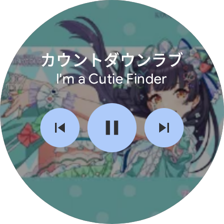

# Wear OS Spotify Widget

> [!WARNING]
> このアプリは現在開発中のため、動作が不安定な場合があります。
> This application is currently under development and may be unstable.



Spotify（およびその他のメディアアプリ）の「再生中の曲」情報と操作コントロールを、手首から素早く行えるWear OSアプリおよびタイルです。

## 特徴
- **Wear OS タイル対応**: ウォッチフェイスをスワイプするだけで、素早く操作パネルにアクセスできます。
- **リアルタイム更新**: 曲の変更や再生/一時停止の状態を即座に検知し、タイルを更新します（`MediaController.Callback` イベント駆動）。
- **ダイナミック背景**: 再生中のアルバムアートワークが背景として表示されます。
- **再生コントロール**: 再生/一時停止、曲送り、曲戻しの操作が可能です。
- **汎用互換性**: Androidの `MediaSession` を実装している音楽プレーヤー（Spotify, YouTube Musicなど）であれば動作します。
- **表示中常時更新**: タイルが表示されている間は、イベント駆動に加え定期的な再描画も行い、情報の遅延を防ぎます。

## 必要要件
- Wear OS デバイス (API 34 / Wear OS 5 ターゲット)。
- **「通知へのアクセス」権限**: 他のアプリの再生情報（メタデータ）を取得するために、Androidのセキュリティ仕様上この権限が必要です。

## セットアップ手順

### 権限の付与（重要）
多くのWear OSデバイスやエミュレータでは、「通知へのアクセス」設定画面が隠されているか、アクセスできません。**そのため、ADBコマンドを使用して権限を付与する必要があります。**

アプリをインストールした後、以下のコマンドを実行してください：
```bash
adb shell cmd notification allow_listener com.github.hiryuto_oecu.wearos_spotify_widget/.SpotifyWidgetService
```

### 手動セットアップ（メニューが表示される場合）
1. アプリをWear OSデバイスに**インストール**します。
2. アプリを**起動**します。初回起動時に「Permission Required」と表示される場合は、ボタンを押して権限設定に進みます。
3. 設定画面で「Spotify Widget」の「通知へのアクセス」を**許可（ON）**にします。
4. **タイルを追加**します:
    - タイルの一覧を最後までスワイプします。
    - 「タイルを追加」を選択します。
    - 「Spotify Widget」を選んで追加します。

## 開発情報
- **言語**: Kotlin
- **UIツールキット**: ProtoLayout (Tiles) & Compose for Wear OS (Main Activity)
- **アーキテクチャ**:
    - `MainActivity`: 権限チェックと設定誘導を含むメイン画面。
    - `SpotifyTileService`: タイルのメイン実装。バッテリー消費を抑えつつ即応性を高めるため、イベント駆動アーキテクチャを採用しています。
